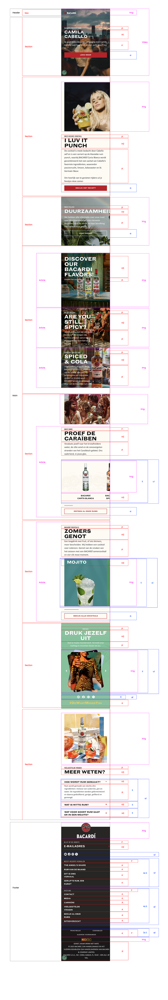
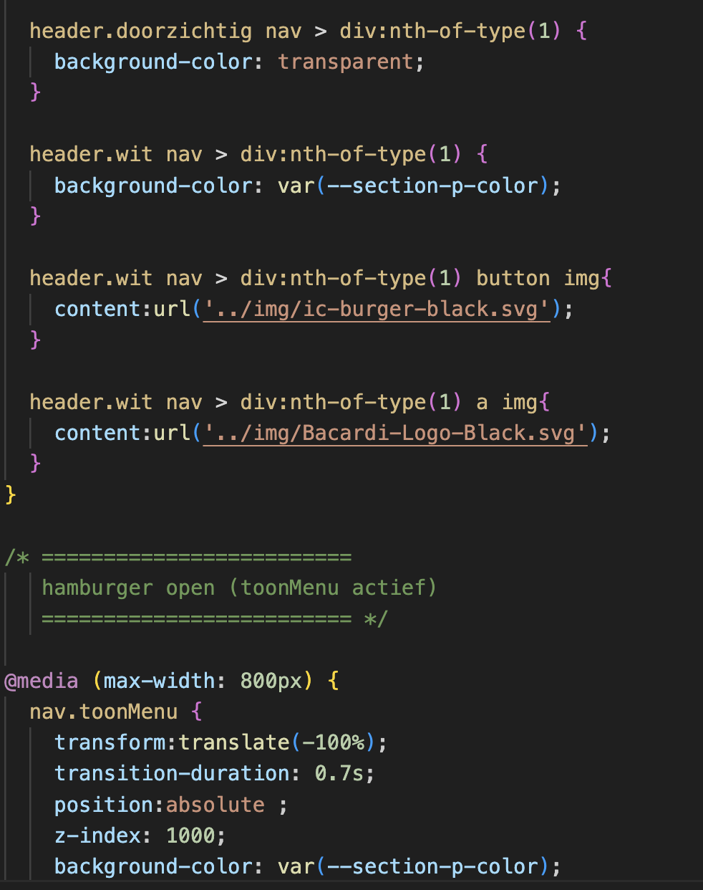

# Procesverslag
Markdown is een simpele manier om HTML te schrijven.  
Markdown cheat cheet: [Hulp bij het schrijven van Markdown](https://github.com/adam-p/markdown-here/wiki/Markdown-Cheatsheet).

Nb. De standaardstructuur en de spartaanse opmaak van de README.md zijn helemaal prima. Het gaat om de inhoud van je procesverslag. Besteedt de tijd voor pracht en praal aan je website.

Nb. Door *open* toe te voegen aan een *details* element kun je deze standaard open zetten. Fijn om dat steeds voor de relevante stuk(ken) te doen.

## Jij

  
uitwerken voor kick-off werkgroep

  ### Auteur:
  Marell bouhof

  #### Je startniveau:
  rood
  #### Je focus:
  responsive
 

## Je website

  
uitwerken voor kick-off werkgroep

  ### Je opdracht:
  bacardi.com. Ik vind deze website heel aantrekkelijk eruit zien en het is ook een uitdaging voor mij. Daarnaast wil ik graag focussen op responsive, al hoe wel de bacari website ook goed is voor surface plane. 

  #### Screenshot(s) van de eerste pagina (small screen): 
  homepagina, hier komen veel verschillende onderdelen in terug
  

  #### Screenshot(s) van de tweede pagina (small screen):
  over ons, hier kan ik leren hoe je artikels voor elk scherm kan programmeren 
  
 

## Toegankelijkheidstest 1/2 (week 1)

  
uitwerken na test in 2e werkgroep

  ### Bevindingen WCAG checklist
  Lijst met je bevindingen die in de test naar voren kwamen:
  Kiki heeft mijn website bekeken

  Zwakke punten website: 
  - veel script in HTML
  - veel console errors
  - alles in een div en classes
  - sommige img hebben alt en sommige niet, links hebben geen alt
  - video kan je niet op pauze zetten en blijft doorspelen
  - geen gebruik van li

  Sterke punten website: 
  - artikel bij over ons pagina worden niet kleiner bij een kleiner formaat, hierdoor gaan ze onder elkaar staan. Dit geeft wel een mooie vormgeving.

  
  \

  ### Screenshots van test
  
  
  
  
  

  ### Bevindingen screenreader
  Zwakke punten website: 
  - Als je alleen door de links heen wilt dan loop je vat op 'ontdek alle rums'.
  - De bacardi flessen worden niet voorgelezen als dat het bij elkaar hoort, omdat ze niet in een li staan. 
  - De dropdown in het menu word niet voorgelezen. 

  Sterke punten website: 
  - Alles word duidelijk voorgelezen 

## Breakdownschets (week 1)

  
uitwerken na afloop 3e werkgroep

  ### homepagina: 
  

  ### menu: 
  

  ### over ons: 
  

## Voortgang 1 (week 2)

  
uitwerken voor 1e voortgang

  ### Stand van zaken
  hier dit ging goed & dit was lastig (neem ook screenshots op van delen van je website en code)

  Wat ging er goed:
  1. Ik heb de breakdown schets gemaakt en samen met Nienke naar gekeken of het logisch was. Hierdoor heb ik een paar aanpassingen gemaakt, omdat mijn heading order niet helemaal juist was en ik miste de ul om de li items heen. 
  2. Het schrijven van de html ging erg goed, ik heb mijn breakdownschets uitgeprint en naast mijn laptop gelegd terwijl ik aan het typen was. Dit was voor mij erg overzichtelijk. 

  Dit was lastiger:
  1. Nu ik mijn html had vond ik het erg lastig om te bedenken waar ik moest beginnen met de CSS. 

  ### Verslag van de meeting
  Dit heb ik allemaal aangepast na feedback uit de meeting:
  - Voor uitklap details gebruiken in html.
  - Geen h3 gebruiken in list items als het niet nodig is. 
  - Geen break gebruiken voor 2 regels tekst, maar width gebruiken.
  - Meerdere secties tegelijk aanspreken als ze allemaal dezelfde code nodig hebben (zoals kleur of margin)
  - Var kan je ook gebruiken voor margin of andere dingen

## Voortgang 2 (week 3)

  
uitwerken voor 2e voortgang

  ### Stand van zaken
  Wat ging er goed:
  1. De video in de website ging makkelijk.
  2. Het werken @media ging goed, ik ben van het begin af aan responsive gaan werken omdat ik dit fijner vond.

  Dit was lastig:
  1. Het werken met grid voor de 3 artikels. Danny heeft hierbij geholpen in de les.
  2. De margins en padding op elke section hetzelfde krijgen.
  3. Image als background en de tekst erboven. 

  
  
  

  ### Verslag van de meeting
  Dit heb ik allemaal aangepast na feedback uit de meeting:
  - Eerst beginnen met algemene flex en grid in css voordat je specifieke dingen gaat ontwerpen. 
  - Sommige images uit de HTML halen die niet belangrijk zijn, zodat ik ze als background in css kan toevoegen.
  - Readme aanvullen.
  - Zo doorgaan met sturctuur in css, want het was erg overzichtelijk.

## Toegankelijkheidstest 2/2 (week 4)

  
uitwerken na test in 2e werkgroep

  ### Bevindingen WCAG checklist
  Zwakke punten website: 
  - Toegankelijkheid is nogsteeds minder door geen dark/light mode, tekst aanpassing en high-contrast mode etc. 

  Sterke punten website: 
  - Geen validator waarschuwingen (op de screenshots staat nog nee, maar dit heb ik inmiddels verbeterd).
  - Heading levels zijn op de juiste volgorde.
  - Gebruik van ul voor li items.
  - Alles heeft een alt.
  - Video is nu een background, dus hij werkt niet. Maar ik heb de Java ervoor wel.
  - CSS en Java is los van HTML.
  
  ### Screenshots van test
  
  
  
  
  

  ### Bevindingen screenreader
  Zwakke punten website: 
  - Images die eigenlijk als decoratie bieden worden ook voorgelezen.

  Sterke punten website: 
  - Alles word duidelijk voorgelezen.
  - Het is makkelijk ook helemaal door de website te lopen, maar ook om bijvoorbeeld alleen links te selecteren.

## Voortgang 3 (week 4)

  
uitwerken voor 3e voortgang

  ### Stand van zaken
  Wat ging er goed:
  1. Html elementen in css aanspreken met nth-of-type. Ik heb voor een paar dingen classes gebruikt als het niet anders kon of het niet werkte.
  2. Begrijpen wanneer ik flex of grid nodig had. 

  Dit was lastig:
  1. Het lukte mij niet op css aan te passen van de tweede pagina, terwijl er niks veranderd op de eerste. Ookal zetten in een class op de body van de over ons pagina. Hierdoor heb ik besloten 3 css bestanden aan te maken, ondanks dat dit niet de beste oplossing was. 
  2. Ik vond het soms lastig te zien hoe ik dingen moest maken. Wat voor css er nodig was of het met Javascript moest. Hier heb ik tijdens de lessen gelijk vragen gesteld bij de studentenassistent. Zoals de opmaak van details, vragen over carroussel, etc. 
  3. De header vond ik heel lastig, omdat hij java nodig had en css hover en transition. De laatste feedbacksessie heb ik van half 10 tot 1 gezeten om hier aan te werken en vragen te stellen waar het nodig was aan de studentenassistenten. 

  
  
  
  
  
  
  
  
  

## Eindgesprek (week 5)

  
uitwerken voor eindgesprek

  ### Je uitkomst - karakteristiek screenshots:
  
  

  ### Dit ging goed/Heb ik geleerd: 
  Ik ben echt super ver gekomen dan wanneer ik begon. Ik heb geleerd om met nth-of-type, caroussels, grid, background image, transitions, hover en hamburgermenu te werken. Maar vooral ook sneller de fouten te zoeken via inspecteren, ik snap sneller waarom iets niet werkt en wat er nodig is om het wel te laten werken. Dit vind ik erg waardevol. Ik vind het ook fijn om nth-of-type te gebruiken, zodat ik geen classes of ID hoef te gebruiken. Ook vind ik het heel handig om te begrijpen en snappen hoe responsive werkt, aangezien dit straks nodig is voor alle websites die ik in de toekomst ga maken.   

  Ik ben ook erg trots hoe mijn website eruit ziet. Natuurlijk mis ik wat dingen, maar grotendeels is het precies hoe ik in gedachten had. Ik had niet verwacht toen ik net begon met mijn CSS en vastliep op de kleinste dingetjes. De header, transities, java en grid elementen ben ik wel het meerst trots op. 

  Dit zijn onderdelen van de website waar ik het meeste trots op ben:

  
  
  
  
  

  ### Dit was lastig/Is niet gelukt:
  Er zijn best wat dingen wat helaas niet is gelukt, omdat ik niet wist hoe het moest en in tijdsnoot zat:
  1. Hover effect op de header. (de a worden wel rood, maar de achtergrondkleur past niet aan)
  2. De sectie van 'zomersgenot' carrousel swiped niet hetzelfde, ik zou niet moeten doen in Java. Maar ook de studentenassitenten hadden niet echt een duidelijk idee hoe het moest.
  3. Op de echte site staan sommige buttons in desktop op een andere plek dan op telefoon, dit heb ik niet. 
  4. Mijn footer word op inspecteren telefoon afgehakt, maar als ik mijn website op mijn telefoon kijk heb ik hier geen last van. 
  5. Ik heb geen dropdown in mijn menu, want ik had hier helaas niet genoeg tijd voor. 
  6. Ik zou wel meer willen leren over Javascript. Ik merk dat ik het toch lastig vind en nog weinig ervaring erin heb. 
  7. Als ik meer tijd had zou ik heel graag een dark light mode optie in mijn website willen hebben. 
  8. De video kan niet op pauze doordat de tekst helemaal over de video heen gaat, dit had ik ook wel willen oplossen. 
  9. Image hover op over ons pagina. 
  10. Java op section 8 en 9 dat die images veranderen.

  
  
  
  
  
  

## Bronnenlijst

  
Bronnenlijst

  1. Veel kleine dingen opgezocht op https://developer.mozilla.org/en-US/, dit heb ik niet alleen opgeslagen (sorry, ik was dan helemaal in werkmodus)
  3. flex-wrap: https://developer.mozilla.org/en-US/docs/Web/CSS/flex-wrap
  4. details marker: https://stackoverflow.com/questions/56758098/how-to-position-detail-marker-to-come-after-summary
  5. chat GPT chat over header, hover en java: https://chatgpt.com/share/68da2eb3-5e34-8008-b468-b49af7cfc3d3, https://chatgpt.com/share/68da2fba-c1ac-8008-840b-4603cc8c32d2
  6. aanspreken css: https://developer.mozilla.org/en-US/docs/Web/CSS/:nth-of-type
  7. tekst slide java: https://codepen.io/Nienke-the-styleful/pen/zYgYomN
  8. header: https://codepen.io/shooft/pen/myepoJo
  9. grid uitleg: https://codepen.io/shooft/pen/vENpBKR
  10. over ons pagina: https://blog.pixelfreestudio.com/using-css-grid-and-flexbox-together-best-practices/
  11. carrousel: https://codepen.io/shooft/pen/QwjQGZe
  12. hamburger menu: https://codepen.io/shooft/pen/myepoJo

