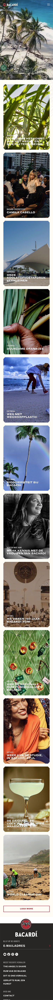

# Procesverslag
Markdown is een simpele manier om HTML te schrijven.  
Markdown cheat cheet: [Hulp bij het schrijven van Markdown](https://github.com/adam-p/markdown-here/wiki/Markdown-Cheatsheet).

Nb. De standaardstructuur en de spartaanse opmaak van de README.md zijn helemaal prima. Het gaat om de inhoud van je procesverslag. Besteedt de tijd voor pracht en praal aan je website.

Nb. Door *open* toe te voegen aan een *details* element kun je deze standaard open zetten. Fijn om dat steeds voor de relevante stuk(ken) te doen.

## Jij

  
uitwerken voor kick-off werkgroep

  ### Auteur:
  Marell bouhof

  #### Je startniveau:
  rood
  #### Je focus:
  responsive
 

## Je website

  
uitwerken voor kick-off werkgroep

  ### Je opdracht:
  bacardi.com. Ik vind deze website heel aantrekkelijk eruit zien en het is ook een uitdaging voor mij. Daarnaast wil ik graag focussen op responsive, al hoe wel de bacari website ook goed is voor surface plane. 

  #### Screenshot(s) van de eerste pagina (small screen): 
  homepagina, hier komen veel verschillende onderdelen in terug
  

  #### Screenshot(s) van de tweede pagina (small screen):
  over ons, hier kan ik leren hoe je artikels voor elk scherm kan programmeren 
  
 

## Toegankelijkheidstest 1/2 (week 1)

  
uitwerken na test in 2e werkgroep

  ### Bevindingen
  Lijst met je bevindingen die in de test naar voren kwamen:
  Kiki heeft mijn website bekeken

  Zwakke punten website: 
    - veel script in HTML
    - veel console errors
    - alles in een div en classes
    - sommige img hebben alt en sommige niet, links hebben geen alt
    - video kan je niet op pauze zetten en blijft doorspelen

  Sterke punten website: 
    - screen gaat wel duidelijk door de website heen
    - artikel bij over ons pagina worden niet kleiner bij een kleiner formaat, hierdoor gaan ze onder elkaar staan. Dit geeft wel een mooie vormgeving.

  
  

## Breakdownschets (week 1)

  
uitwerken na afloop 3e werkgroep

  ### homepagina: 
  

  ### menu: 
  

  ### over ons: 
  

  
uitwerken voor 3e voortgang

  ### Stand van zaken
  hier dit ging goed & dit was lastig (neem ook screenshots op van delen van je website en code)

## Eindgesprek (week 5)

  
uitwerken voor eindgesprek

  ### Je uitkomst - karakteristiek screenshots:
  

  ### Dit ging goed/Heb ik geleerd: 
  Korte omschrijving met plaatjes

  

  ### Dit was lastig/Is niet gelukt:
  Korte omschrijving met plaatjes

  

## Bronnenlijst

  
continu bijhouden terwijl je werkt

  Nb. Wees specifiek ('css-tricks' als bron is bijv. niet specifiek genoeg). 
  Nb. ChatGpT en andere AI horen er ook bij.
  Nb. Vermeld de bronnen ook in je code.

  1. Veel kleine dingen opgezocht op https://developer.mozilla.org/en-US/, dit heb ik niet alleen opgeslagen (sorry, ik was dan helemaal in werkmodus)
  3. flex-wrap: https://developer.mozilla.org/en-US/docs/Web/CSS/flex-wrap
  4. details marker: https://stackoverflow.com/questions/56758098/how-to-position-detail-marker-to-come-after-summary
  5. chat GPT chat over header, hover en java: https://chatgpt.com/share/68da2eb3-5e34-8008-b468-b49af7cfc3d3, https://chatgpt.com/share/68da2fba-c1ac-8008-840b-4603cc8c32d2
  6. aanspreken css: https://developer.mozilla.org/en-US/docs/Web/CSS/:nth-of-type
  7. tekst slide java: https://codepen.io/Nienke-the-styleful/pen/zYgYomN
  8. header: https://codepen.io/shooft/pen/myepoJo
  9. grid uitleg: https://codepen.io/shooft/pen/vENpBKR
  10. over ons pagina: https://blog.pixelfreestudio.com/using-css-grid-and-flexbox-together-best-practices/
  11. carrousel: https://codepen.io/shooft/pen/QwjQGZe
  

